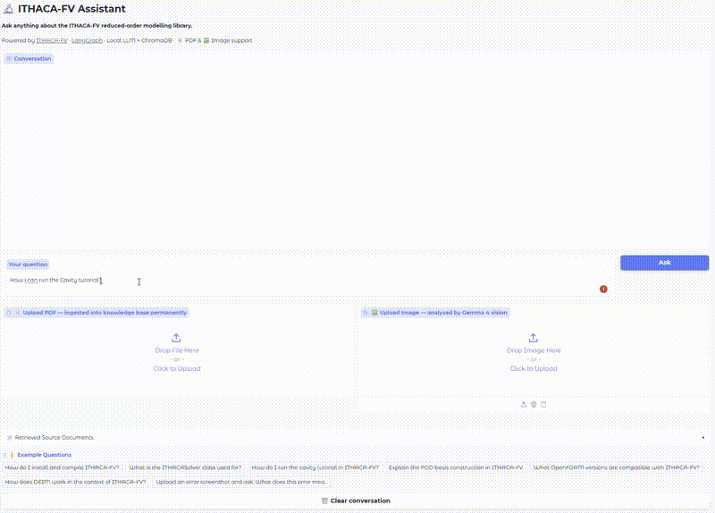
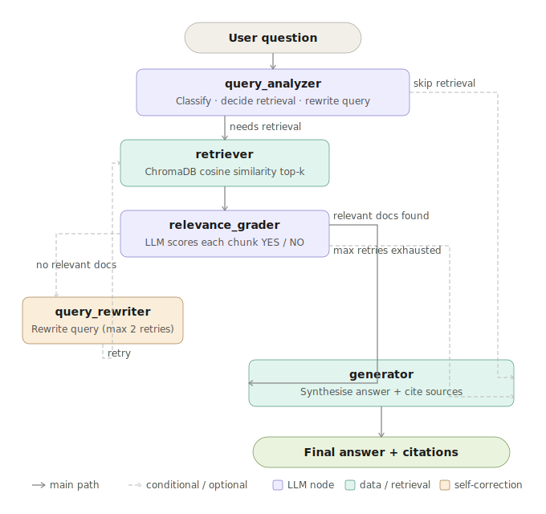
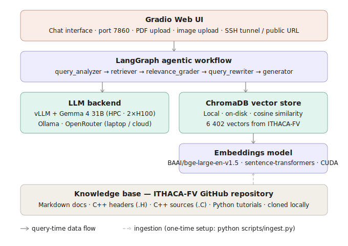

# 🔬 ITHACA-FV Agentic RAG Assistant

[](https://www.python.org/)
[](https://github.com/langchain-ai/langgraph)
[](https://www.trychroma.com/)
[](https://gradio.app/)
[](LICENSE)

A **fully local** Agentic Retrieval-Augmented Generation (RAG) assistant that answers questions about [ITHACA-FV](https://github.com/ITHACA-FV/ITHACA-FV), the open-source C++ library for Physics-Based Reduced Order Modelling (ROM) built on OpenFOAM.

> Developed as part of PhD research at **SMARTLab, BioRobotics Institute (Sant'Anna School of Advanced Studies / University of Pisa)**, within the **ERC DANTE project**, supervised by Prof. [Giovanni Stabile](https://www.giovannistabile.com), the original developer of [ITHACA-FV](https://github.com/ITHACA-FV/ITHACA-FV).

---

## Demo



## 🎯 What It Does

| Question type | Example |
|---|---|
| **Installation** | *"How do I compile ITHACA-FV on Ubuntu 22.04?"* |
| **API / Classes** | *"What does the `ITHACASolver` class do?"* |
| **Tutorials** | *"How do I run the cavity ROM tutorial?"* |
| **Theory** | *"Explain POD and DEIM as used in ITHACA-FV."* |
| **Troubleshooting** | *"Why does `Allwmake` fail with a missing header?"* |

The assistant **intelligently decides** whether to search the documentation, rewrites failed queries, grades retrieved chunks for relevance, and generates grounded answers with source citations, all without sending a single byte to the cloud.

---

## 🏗️ System Architecture



### Component Stack



---

## 📂 Project Structure

```
ithaca_fv_rag/
├── assets/
│   └── Demo2.gif
├── config/
│   └── config.yaml          ← all settings in one place (LLM, embeddings, RAG params)
│
├── src/
│   ├── ingestion/
│   │   ├── loader.py        ← clones ITHACA-FV repo, reads files into Documents
│   │   └── chunker.py       ← splits docs into overlapping chunks (type-aware)
│   │
│   ├── embeddings/
│   │   └── embedder.py      ← local sentence-transformers wrapper (LangChain-compatible)
│   │
│   ├── vectorstore/
│   │   └── chroma_store.py  ← build / load / query ChromaDB
│   │
│   ├── rag/
│   │   ├── state.py         ← AgentState TypedDict (the "blackboard")
│   │   ├── prompts.py       ← all LLM prompt templates
│   │   ├── nodes.py         ← LangGraph node functions (analyzer, retriever, grader, …)
│   │   ├── agent.py         ← builds & compiles the LangGraph StateGraph
│   │   └── llm_factory.py   ← returns the right LangChain LLM for your provider
│   │
│   └── app/
│       └── gradio_app.py    ← Gradio chat UI
│
├── scripts/
│   ├── ingest.py            ← run once to build the vector store
│   ├── run_app.py           ← launch the Gradio app
│   └── slurm/
│       ├── ingest.slurm     ← SLURM batch job for ingestion (1 GPU)
│       └── serve.slurm      ← SLURM batch job for vLLM + Gradio (4 GPUs)
│
├── tests/
│   └── test_agent.py        ← unit + integration tests (pytest)
│
├── data/                    ← auto-created; gitignored
│   ├── ITHACA-FV/           ← cloned repository
│   └── chroma_db/           ← persistent vector store
│
├── .env.example             ← copy to .env and add your API keys
├── requirements.txt
├── setup.py
└── README.md
```

---

## 🚀 Quick Start

### Prerequisites

- Python 3.10+
- Git
- CUDA-capable GPU (recommended; CPU works but is slow for embeddings)
- One of: **vLLM + Gemma 4** (HPC), **Ollama** (laptop), or an **OpenRouter** free API key

---

### 1- Clone This Repository

```bash
git clone https://github.com/YOUR_USERNAME/ithaca-fv-rag.git
cd ithaca-fv-rag
```

### 2 — Create Environment & Install Dependencies

```bash
# Using conda (recommended on HPC)
conda create -n ithaca_rag python=3.10 -y
conda activate ithaca_rag

# HPC only: redirect pip tmp to avoid /tmp quota issues
# Replace <your_storage> with your actual path (e.g. /storage/home/username)
export TMPDIR=<your_storage>/tmp
mkdir -p $TMPDIR

# Install Python packages
pip install -r requirements.txt

# Additional dependencies (install after requirements.txt)
pip install --upgrade transformers    # Gemma 4 requires transformers 5.5+
pip install langchain-text-splitters sentence-transformers langchain-chroma
```

### 3 — Configure

Edit `config/config.yaml` to select your LLM provider (vLLM is the default):

```yaml
llm:
  provider: "vllm"
  model: "<your_storage>/models/gemma-4-31b-it"
  base_url: "http://localhost:8000/v1"
```

Only needed if using OpenRouter:
```bash
cp .env.example .env    # then add OPENROUTER_API_KEY=sk-or-...
```

### 4 — Set Up Your LLM

**Option A: vLLM + Gemma 4 31B (recommended for HPC with H100s):**
```bash
# Install vLLM (requires transformers 5.5+ for Gemma 4 support)
pip install --upgrade transformers
pip install vllm --upgrade

# Download Gemma 4 model weights (~60 GB, run once)
pip install huggingface_hub
hf download google/gemma-4-31b-it \
    --local-dir <your_storage>/models/gemma-4-31b-it

# Start the vLLM server in a tmux session (keep running while using the app)
tmux new -s vllm_server
vllm serve <your_storage>/models/gemma-4-31b-it \
    --tensor-parallel-size 2 \
    --max-model-len 32768 \
    --gpu-memory-utilization 0.90 \
    --host 0.0.0.0 \
    --port 8000
# Wait for: "INFO: Application startup complete."
```

**Option B: Ollama (easiest, recommended for laptop/workstation):**
```bash
# Install: https://ollama.ai
ollama pull gemma3:27b          # ~17 GB  (best quality)
# or: ollama pull llama3.1:8b  # ~4.7 GB (lighter)
ollama serve                    # keep running in a separate terminal
```
Then set in `config/config.yaml`:
```yaml
llm:
  provider: "ollama"
  model: "gemma3:27b"
```

**Option C: OpenRouter (no local GPU needed, free API):**
```bash
# Get a free key at https://openrouter.ai (no credit card needed)
cp .env.example .env
# Add to .env:  OPENROUTER_API_KEY=sk-or-...
```
Then set in `config/config.yaml`:
```yaml
llm:
  provider: "openrouter"
  model: "google/gemma-4-31b-it:free"
```

### 5 — Ingest ITHACA-FV Documentation

**HPC only: redirect HuggingFace cache to avoid home directory quota issues:**
```bash
# Replace <your_storage> with your actual storage path
export HF_HOME=<your_storage>/hf_cache
export TRANSFORMERS_CACHE=<your_storage>/hf_cache
mkdir -p $HF_HOME

# Make it permanent across sessions
echo "export HF_HOME=$HF_HOME" >> ~/.bashrc
echo "export TRANSFORMERS_CACHE=$HF_HOME" >> ~/.bashrc
source ~/.bashrc
```

**Run ingestion:**
```bash
# Clones ITHACA-FV, chunks all docs, embeds them, saves to ChromaDB
# Run once — re-run only when the ITHACA-FV repo is updated
python scripts/ingest.py
```


### 6 — Launch the Chat App

**First, make sure the vLLM server is running** (see Step 4 Option A). Then in a new terminal:

```bash
conda activate ithaca_rag
cd ithaca-fv-rag
python scripts/run_app.py
# Open http://localhost:7860
```

**On HPC — access from your laptop via SSH tunnel:**
**On HPC — two ways to access from your laptop:**

**Option 1: SSH tunnel** (private, no expiry):
```bash
# Run this on your laptop, then open http://localhost:7860
# Kill any existing process on port 7860 first if needed:
#   Windows: netstat -ano | findstr :7860  →  taskkill /PID <PID> /F
#   Linux/Mac: lsof -ti:7860 | xargs kill
ssh -L 7860:localhost:7860 your_username@<cluster_ip>
```

**Option 2: Public Gradio URL** (easiest, no SSH tunnel needed):

Set in `config/config.yaml`:
```yaml
app:
  share: true
```
Then run `python scripts/run_app.py` — Gradio will print a public URL like:

Open that link in any browser, on any device, anywhere in the world.

> **Note:** The public URL is only active while the app is running on the cluster,
> and expires after 1 week. For a permanent public URL, deploy to
> [Hugging Face Spaces](https://huggingface.co/spaces) with `gradio deploy`.

---

## 🖥️ Running on HPC (hpcsrv — 4×H100 80GB)

The cluster uses **Slurm** with a `compute` partition. Two job scripts are provided.

### Ingestion Job (1 GPU, ~30 min)

```bash
sbatch scripts/slurm/ingest.slurm
squeue -u $USER                  # monitor
```

### Serving Job (4 GPUs — vLLM + Gradio)

```bash
sbatch scripts/slurm/serve.slurm
```

Then **SSH port-forward** to your laptop:

```bash
ssh -L 7860:hpcsrv:7860 your_username@hpcsrv
# Open http://localhost:7860 in your browser
```

Alternatively, set `share: true` in `config/config.yaml` to get a public Gradio URL
(no SSH tunnel needed):

```bash
python scripts/run_app.py --share
```

### Recommended Config for H100 Cluster

```yaml
embeddings:
  model: "BAAI/bge-large-en-v1.5"   # best quality — 1.3 GB, fits easily in H100
  device: "cuda"
  batch_size: 256                    # H100 handles large batches

llm:
  provider: "vllm"
  model: "<your_storage>/models/gemma-4-31b-it"
  base_url: "http://localhost:8000/v1"
  # Serve with: vllm serve <model_path> --tensor-parallel-size 2
  # Use --tensor-parallel-size 4 to free up 2 GPUs for other jobs

rag:
  top_k: 8
```

---

## ⚙️ Configuration Reference

All settings live in `config/config.yaml`. No need to touch Python code.

| Section | Key | Default | Description |
|---|---|---|---|
| `llm` | `provider` | `"ollama"` | `ollama` / `vllm` / `openrouter` |
| `llm` | `model` | `"gemma-4-31b-it"` | model name / path for the chosen provider |
| `llm` | `temperature` | `0.1` | lower = more factual |
| `embeddings` | `model` | `"BAAI/bge-base-en-v1.5"` | sentence-transformers model |
| `embeddings` | `device` | `"cuda"` | `cuda` or `cpu` |
| `embeddings` | `batch_size` | `64` | raise to 256+ on H100 |
| `vectorstore` | `persist_dir` | `"./data/chroma_db"` | ChromaDB storage path |
| `ingestion` | `chunk_size` | `1000` | characters per chunk |
| `ingestion` | `chunk_overlap` | `150` | overlap between chunks |
| `rag` | `top_k` | `5` | docs retrieved per query |
| `rag` | `max_retries` | `2` | query-rewrite attempts |
| `rag` | `score_threshold` | `0.35` | min cosine similarity |
| `app` | `port` | `7860` | Gradio port |
| `app` | `share` | `false` | `true` for public Gradio URL |

---

## 🧪 Running Tests

```bash
# Fast unit tests only (no GPU/LLM needed — uses mocks)
pytest tests/ -v -k "not integration"

# Full integration test (requires vLLM running + ingested ChromaDB)
pytest tests/ -v -k "integration"
```

---

## 🗺️ LLM Provider Comparison

| Provider | Cost | Privacy | Speed | GPU needed? | Best for |
|---|---|---|---|---|---|
| **vLLM + Gemma 4** | Free | 🔒 100% local | 🚀 Fast | Yes (H100 ×2) | HPC cluster ← **this project** |
| **Ollama** | Free | 🔒 100% local | Medium | No (CPU works) | Laptop / workstation |
| **OpenRouter** | Free tier | ☁️ Cloud | Fast | No | Quick prototyping / no GPU |

### Free OpenRouter Models That Work Well

| Model | Context | Notes |
|---|---|---|
| `google/gemma-4-31b-it:free` | 256k | Best free option — same model as local |
| `google/gemma-4-26b-a4b-it:free` | 256k | MoE variant — faster, near same quality |
| `meta-llama/llama-3.1-8b-instruct:free` | 128k | Lighter fallback |

---

## 🔧 Extending the Knowledge Base

By default the system ingests `.md`, `.H`, `.C`, `.py`, and `.txt` files from the
ITHACA-FV repo. You can extend it:

**Add OpenFOAM documentation:**
```yaml
# config.yaml
ingestion:
  local_repo_path: "./data/ITHACA-FV"
  # Point to additional local directories:
  extra_dirs:
    - "./data/OpenFOAM-docs"
    - "./data/my-custom-notes"
```

**Re-run ingestion** after any change to the knowledge base:
```bash
python scripts/ingest.py
```

---

## 🤝 Contributing

Contributions are very welcome! This project is designed to help the ITHACA-FV
community, so any improvement — better prompts, new document sources, additional
LLM backends — is valuable.

1. Fork the repo
2. Create a feature branch (`git checkout -b feature/better-prompts`)
3. Make your changes and add tests
4. Run `pytest tests/ -v -k "not integration"`
5. Open a Pull Request

---

## 📚 How Agentic RAG Differs from Standard RAG

| Standard RAG | Agentic RAG (this project) |
|---|---|
| Always retrieves | Decides *whether* to retrieve |
| Fixed query | Rewrites query if retrieval fails |
| Returns all results | Grades each chunk for relevance |
| Single LLM call | Multi-step reasoning loop |
| No self-correction | Retries up to `max_retries` times |

---

## 📖 Citation

If you use this project in your research, please cite:

```bibtex
@software{bakhshaei2025ithaca_rag,
  author    = {Bakhshaei, Kabir},
  title     = {ITHACA-FV Agentic RAG Assistant},
  year      = {2025},
  url       = {https://github.com/YOUR_USERNAME/ithaca-fv-rag},
  note      = {Developed at SMARTLab, BioRobotics Institute, Sant'Anna School
               of Advanced Studies, within the ERC DANTE project (Grant 101115741)}
}
```

---

## 📄 License

MIT: see [LICENSE](LICENSE).

---

## 🙏 Acknowledgements

- [ITHACA-FV](https://github.com/ITHACA-FV/ITHACA-FV) by Prof. Giovanni Stabile et al.
- [LangChain](https://github.com/langchain-ai/langchain) and [LangGraph](https://github.com/langchain-ai/langgraph)
- [ChromaDB](https://www.trychroma.com/) — local vector database
- [Sentence Transformers](https://www.sbert.net/) — local embeddings
- [Gradio](https://gradio.app/) — web interface
- [Ollama](https://ollama.ai/) and [vLLM](https://github.com/vllm-project/vllm) — local LLM serving
- ERC DANTE project (Grant No. 101115741) for supporting this research
